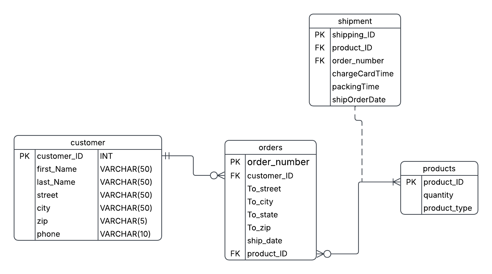

# Basic E-commerce Database

## ER Diagram

## Tables

- Customer
- Product
- Order
- OrderItem

## Concepts Covered

- Primary Keys
- Foreign Keys
- Composite Keys
- One-to-Many
- Many-to-Many

## Files

- problem-statement.md
- requirements.md
- schema.sql
- notes.md